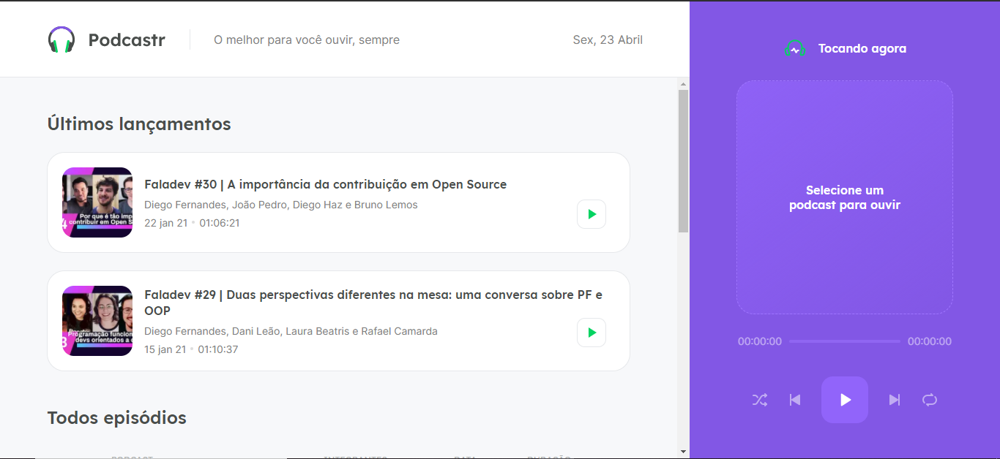
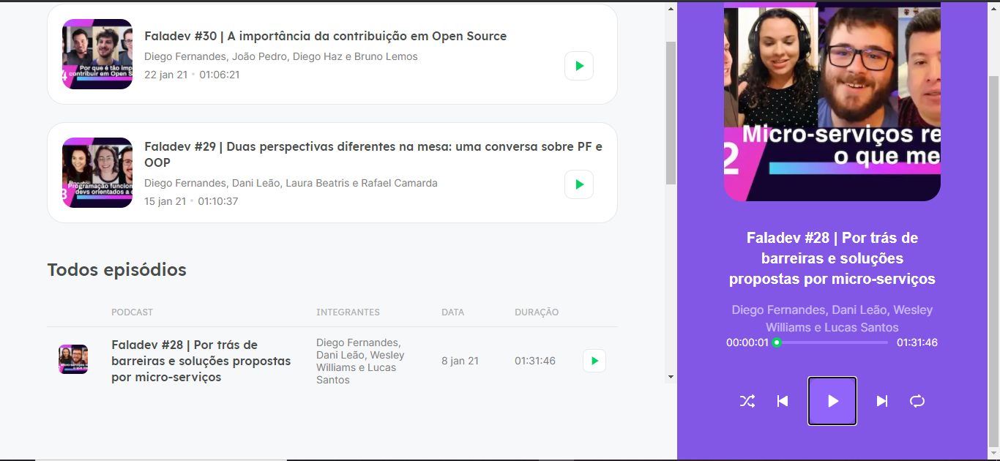

<h1 align="center">
 Podcaster
</h1>

### 🚀 O que é o Podcaster ?

O Podcaster é uma aplicação web para escutar nossos podcasts.💜

<p align="center">





</p>

## 🚀 Funcionalidades

- Tocar um podcast
- Tocar próximo podcast
- Tocar podcast anterior
- Modo aleatório
- Modo loop

## 🚀 Tecnologias

Esse projeto foi desenvolvido com as seguintes tecnologias:

- [ReactJs](https://reactjs.org)
- [NextJS](https://nextjs.org/)
- [TypeScript](https://www.typescriptlang.org/)

## Instalação 👻

Clone ou faça o downlod desse repositório:

```
# Clone o repositório
$ git clone https://github.com/rafaelone/podcaster
```

Acesse a pasta server e faça as instalações:

```
# Acesse a pasta
$ cd podcaster

# Instale as dependencias
$ yarn
```

Em terminais separados, execute:

```
  yarn dev
```

```
  yarn server
```

#### Próximos passsos:

- Deixar responsivo;
- Troca de tema baseado no omni rocketseat
- Fazer uma PWA

Agradecimentos [Rocketseat NextLevelWeek](https://rocketseat.com.br/) 🚀

👤 **Rafael Sergio**

- Github: [Rafael Sergio](https://github.com/rafaelone)
- Linkedin: [Rafael Sergio](https://www.linkedin.com/in/rafael-sergio-982951103/)
